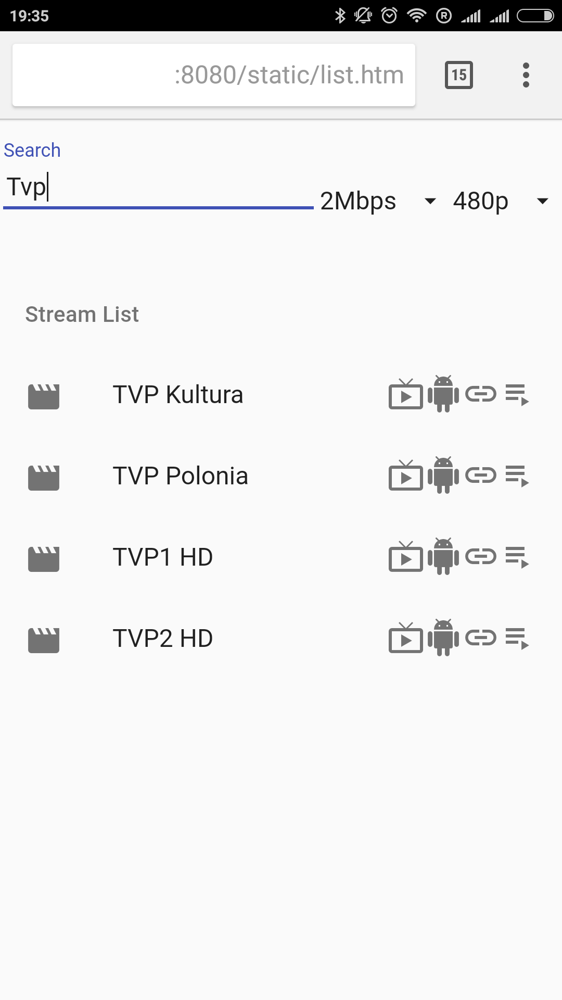

# gostreamer

On-demand media streaming server using ffmpeg as transcoding engine written in Go.
Transcoding is started as soon as first client asks for it and stopped 30 seconds after last client disconnect.
Creates valid stream playable in modern browsers, Android, VLC and other compatible players

## Setup & Run
* ```go build```
* ```./gostreamer```
* open interface in browser http://server:8080/

## Import sources from CSV
* create ```sources.csv``` with format 'Stream name,Stream url', e.g.:
```
My stream,udp://@239.1.1.1:1234
Other stream,http://server/file.mp4
```
* post file to server
```
curl -X POST --data-binary @sources.csv http://localhost:8080/sources/csv
```

## Install as service
```
ln -s /opt/gostream/gostream.service /etc/systemd/system/gostream.service
systemctl daemon-reload
systemctl enable gostream
systemctl start gostream
```

## Screenshot

